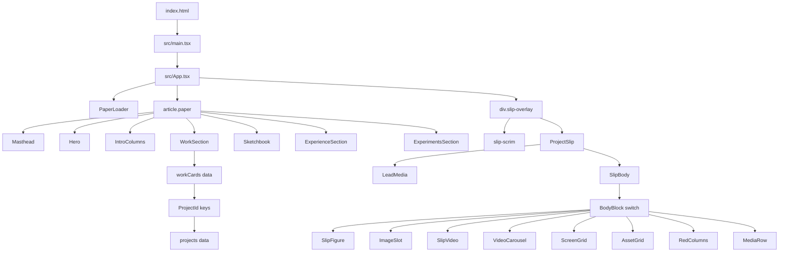
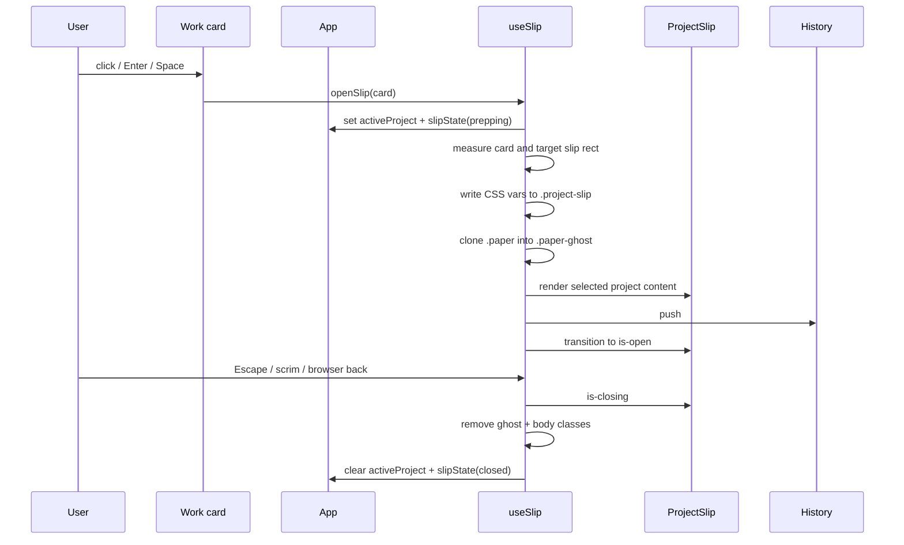

# Component Map

This repo now has two site surfaces:

- `/` is the React + TypeScript newspaper portfolio.
- `/old` is the archived Framer export, preserved under `public/old`.

## Runtime Tree



## File Ownership

| File | Owns | Used by |
| --- | --- | --- |
| `index.html` | Tiny Vite HTML shell, theme preflight script, font links, root mount | Browser loads this for `/` |
| `src/main.tsx` | React root bootstrapping and global CSS import | `index.html` |
| `src/App.tsx` | Page composition, local sections, slip overlay wiring, deep-link effect | `src/main.tsx` |
| `src/components/ProjectSlip.tsx` | Dialog shell for case studies: masthead, title/deck, lead media, intro columns, body | `App` |
| `src/components/Sketchbook.tsx` | StPageFlip lifecycle, physical notebook pages, responsive orientation, and navigation | `App` |
| `src/components/SlipBody.tsx` | All case-study body block renderers | `ProjectSlip` |
| `src/data/workCards.tsx` | Homepage work rail card content and project IDs | `WorkSection` in `App` |
| `src/data/projects.ts` | Full case-study content keyed by project ID | `ProjectSlip`, `useSlip`, deep links |
| `src/hooks/useSlip.ts` | Slip state machine, geometry, ghost paper, Escape/back/resize listeners | `App` |
| `src/hooks/useTheme.ts` | Theme read/write, random theme behavior, localStorage sync | `Masthead` |
| `src/hooks/useReducedMotion.ts` | `prefers-reduced-motion` media query | `App` and then `useSlip` |
| `src/types/project.ts` | Project IDs, project data shape, all body block types | Data + renderers |
| `src/styles/newspaper.css` | Global layout, themes, animations, slip classes, block styling | Imported once in `main.tsx` |
| `public/assets/` | Images, SVGs, videos copied into `dist/assets` | CSS, data, components |
| `public/old/` | Archived Framer site | `/old` |
| `public/old.html` | Tiny local/deploy redirect shim to `/old/` | `/old` clean URL support |

## App Composition

`App` owns three refs:

- `paperRef`: the live newspaper page, used by `useSlip` to clone the paper ghost.
- `overlayRef`: the slip overlay container, used as the insertion point for the ghost.
- `slipRef`: the actual case-study dialog, used for geometry and focus.

`App` also wires:

- `useReducedMotion()` -> passed into `useSlip`.
- `useSlip(...)` -> returns `activeProject`, `slipState`, `openSlip`, `closeSlip`.
- hash deep links -> `/#uber-kids` opens the matching work card on cold load.

## Homepage Sections

All homepage section components currently live inside `src/App.tsx`.

| Component | Purpose | Main CSS contract |
| --- | --- | --- |
| `PaperLoader` | Initial newspaper loading overlay and body class cleanup | `.paper-loader`, `.is-loading`, `.is-loaded` |
| `Masthead` | Issue date, brand mark, theme button, resume link | `.masthead`, `.brand-mark`, `.theme-randomizer` |
| `Hero` | Headline and hero photo | `.hero`, `.headline-block`, `.hero-image` |
| `IntroColumns` | Two-column intro copy | `.intro-columns` |
| `WorkSection` | Horizontal project card rail | `.work-section`, `.work-rail`, `.work-card`, `.project-card` |
| `Sketchbook` | Corner-driven soft-page notebook for photos and working material | `.sketchbook-section`, `.sketchbook-engine`, `.notebook-page` |
| `ExperienceSection` | Experience/sticker area | `.experience`, `.experience-stack`, `.experience-card` |
| `ExperimentsSection` | Experiment placeholder area | `.experiments`, `.image-placeholder` |

Important: `section-reveal`, `.rule`, and sibling order are CSS-sensitive. The stylesheet uses ordering and class names for reveal/stagger behavior, so keep the render order stable unless you are intentionally redesigning the page.

## Slip Flow



`useSlip` is intentionally imperative in a few places:

- It reads `getBoundingClientRect()` from the clicked card.
- It writes `--slip-from-*` custom properties directly to `.project-slip`.
- It clones `.paper` into `.paper-ghost` for the fold animation.
- It manages `history.pushState`, `popstate`, `Escape`, and resize.

Those are the moving parts to treat carefully during refactors.

## Case Study Rendering

`ProjectSlip` receives a `ProjectData` object from `projects[activeProject]`.

It derives:

- `firstImage`: first body image, used as fallback lead media.
- `leadImage`: explicit `project.leadImage` or `firstImage`.
- `introColumns`: explicit `project.introColumns` or first two prose strings.
- `bodyBlocks`: body content minus the fallback lead image.

`SlipBody` groups consecutive string blocks into `.slip-prose`, then renders object blocks through `BodyBlock`.

Supported block types:

| Type | Renderer | Output |
| --- | --- | --- |
| `string` | `SlipBody` prose grouping | `.slip-prose > p` |
| `heading` | `BodyBlock` | `h3` |
| `eyebrow` | `BodyBlock` | `.slip-eyebrow` |
| `image` | `SlipFigure` | `.slip-figure` |
| `image-slot` | `ImageSlot` | `.slip-image-slot-figure` |
| `video` | `SlipVideo` | `.slip-video-figure` |
| `video-carousel` | `VideoCarousel` | `.slip-video-carousel` |
| `screen-grid` | `ScreenGrid` | `.slip-screen-grid` |
| `asset-grid` | `AssetGrid` | `.slip-asset-grid` |
| `red-columns` | `RedColumns` | `.slip-red-columns` |
| `media-row` | `MediaRow` | `.slip-media-row` |
| `small-note` | `BodyBlock` | `.slip-small-note` |
| `divider` | `BodyBlock` | `.slip-section-divider` |
| `quote` | `BodyBlock` | `blockquote` |
| `list` | `BodyBlock` | `ul > li` |

To add a new block type:

1. Add the type to `src/types/project.ts`.
2. Add content using that type in `src/data/projects.ts`.
3. Add a renderer branch in `src/components/SlipBody.tsx`.
4. Add or reuse CSS in `src/styles/newspaper.css`.

## Data Links

`workCards` and `projects` are connected by `ProjectId`.

Example:

- `workCards[].id = "uber-kids"`
- `projects["uber-kids"] = { ... }`
- Card click sets `data-project="uber-kids"`
- `useSlip` validates that key against `projects`
- `ProjectSlip` renders `projects["uber-kids"]`
- Deep link `/#uber-kids` opens the same content

If a homepage card does not open, check these three places first:

1. `src/data/workCards.tsx`: card `id`
2. `src/data/projects.ts`: matching key exists
3. `src/types/project.ts`: `ProjectId` union includes the key

## Route Map

| Route | Source | Notes |
| --- | --- | --- |
| `/` | React app from `index.html` + `src/main.tsx` | New default portfolio |
| `/#project-id` | React app + `App` hash effect | Opens matching slip on cold load |
| `/old` | `public/old.html`, Netlify/Vercel rewrites | Clean URL for old site |
| `/old/` | `public/old/index.html` | Archived Framer site |
| `/assets/...` | `public/assets/...` | Shared static assets copied by Vite |

## CSS Contracts

The app intentionally uses global CSS because the original newspaper design depends on cross-component selectors and body state.

High-impact classes:

- `body.is-loading`, `body.is-loaded`: loader state.
- `body.slip-is-open`, `body.slip-is-returning`: whole-page slip animation state.
- `.paper`: cloned for `.paper-ghost`.
- `.project-card`: clickable source for geometry and project ID.
- `.project-slip`: dialog receiving measured `left`, `top`, `width`, `height`, and `--slip-from-*`.
- `.slip-overlay[hidden]`: hide/show overlay.
- `.paper-ghost`, `.paper-fold-ghost`, `.is-visible`: background fold animation.
- `[data-theme="classic" | "plum" | "pine"]`: theme variables.

When renaming classes, update both JSX and `src/styles/newspaper.css`.

## Deployment Map

| File | Purpose |
| --- | --- |
| `package.json` | Vite scripts: `dev`, `build`, `preview` |
| `netlify.toml` | Build command, publish dir, asset caching, `/old` rewrite |
| `vercel.json` | Clean URLs, `/old` rewrite, asset caching |
| `public/CNAME` | Copied to `dist/CNAME` during build |

Build output should contain:

- `dist/index.html`
- `dist/assets/...`
- `dist/old/index.html`
- `dist/old.html`
- `dist/CNAME`

## Where To Change Things

| Task | Edit |
| --- | --- |
| Change hero text/photo | `Hero` in `src/App.tsx` |
| Change intro copy | `IntroColumns` in `src/App.tsx` |
| Add/remove homepage work card | `src/data/workCards.tsx`, then ensure matching project data |
| Edit case-study content | `src/data/projects.ts` |
| Add a new project slug | `ProjectId` in `src/types/project.ts`, `workCards`, `projects` |
| Change slip animation behavior | `src/hooks/useSlip.ts` and matching CSS |
| Change themes | `src/styles/newspaper.css`, `src/hooks/useTheme.ts` if adding/removing names |
| Change old site archive | `public/old/index.html` and `public/old/styles.css` |
| Change deployment behavior | `netlify.toml`, `vercel.json`, `package.json` |

## Verification Checklist

Run after structural edits:

```bash
npm run build
```

Manual checks:

- `/` loads the React newspaper page.
- `/old` lands on the archived Framer site.
- Clicking every `.project-card` opens the right slip.
- Escape closes the slip.
- Browser back closes an open slip.
- A cold load to `/#uber-kids` opens that case study.
- Theme button changes `[data-theme]`.
- Mobile width has no horizontal overflow.
