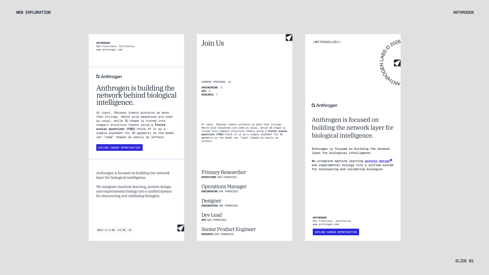

# Design Reference Ledger

This is the working visual and interaction reference set for Parosayshi. References are recorded for the principle they contribute, not as templates to reproduce literally.

## Current synthesis

The folio should feel like a personal publication assembled from real working material:

- **Structure:** a calm newspaper page with clear editorial hierarchy.
- **Movement:** physical sheets, page turns, and objects arriving into the composition.
- **Material:** occasional torn edges, imperfect masks, scans, annotations, and visible construction.
- **Identity:** mostly warm paper and dark ink, interrupted by one assertive blue.
- **Restraint:** analog collage is a featured moment, not a texture pasted across every section.

## Interaction references

### Daily Dispatch

- Reference: [dailydispatch.app](https://www.dailydispatch.app/)
- Contribution: the homepage behaves as a physical sheet; opened stories sit above it as separate pages.
- Use here: case-study reader choreography, background-page repositioning, and the relationship between the index and opened story.
- Avoid: cloning its product layout or letting every transition rotate the full document.

### Matthew Yu sketchbook

- Reference: [site](https://matthewyu.dev/) and [hero video](https://x.com/matthewyuart/status/2076105332108231087/video/1)
- Contribution: preloaded images, a fixed spine, and a real half-page `rotateY` turn with a brief directional smear.
- Use here: the `Sketchbook` section and future photo/notebook material.
- Avoid: treating the whole folio as a carousel.

### StPageFlip

- Reference: [Nodlik/StPageFlip](https://github.com/Nodlik/StPageFlip)
- Contribution: corner-driven fold geometry, soft and hard paper densities, moving inner/outer shadows, touch dragging, and portrait/landscape switching.
- Use here: the notebook engine when a genuinely deforming page matters more than matching Matthew Yu's rigid half-turn exactly.
- Avoid: using it for full-page navigation or turning every case study into a book.

## Analog collage references

### More analog collages

- Reference: [Oliver Hamrin](https://x.com/oliverhamrin/status/2075965093511102465)
- Contribution: found-image combinations, torn apertures, catalogue typography, and deliberately mismatched scales.
- Best home: the future photography/experiments section, where one composed spread can interrupt the cleaner newspaper grid.
- Rule: use actual masks and layered assets; do not fake tactility with generic grain over everything.

### 25 unused posters and covers

- Reference: [Oliver Hamrin](https://x.com/i/status/2050895281428820389)
- Contribution: dense poster composition, type that acts as image, nested frames, and repeated source material.
- Best home: case-study chapter covers, selected-work thumbnails, or a rotating archive of unused explorations.
- Rule: keep body copy quiet. The expressive type belongs to covers and dividers.

### Edge cover shader study

- Reference: [Oliver Hamrin](https://x.com/i/status/2075561040155160957)
- Contribution: a simple collage transformed through a small family of controlled distortions rather than many unrelated effects.
- Best home: a single transition inside the photo archive or an optional hover on one experimental cover.
- Rule: the source collage must already work when motion is disabled; shader treatment is an enhancement.

## Typography and system references

### Anthrogen web exploration board

- Reference: user-provided visual board, saved as `public/assets/references/anthrogen-web-exploration.png`.
- Contribution: a measured editorial serif paired with compact mono metadata; generous white space; thin construction rules; dark ink; and small geometric corner marks.
- Use here: future type-system passes across the masthead, project cards, case-study pages, labels, dates, and calls to action.
- Accent cue: reserve electric blue for useful actions, links, or annotations rather than treating it as a general palette.
- Avoid: copying the biotech voice or layout literally, overusing blue, or replacing the folio's personal newspaper character.

## Identity and color references

### Quartr identity motion

- Reference: [Oliver Hamrin](https://x.com/i/status/2074827273706836165)
- Contribution: identity revealed through construction lines, spacing logic, and confident but short motion.
- Best home: a future Parosayshi wordmark study, issue transition, or tiny masthead detail.
- Rule: keep it separate from page loading. Brand motion should not delay access to the folio.

### Blue things archive

- Reference: [Oliver Hamrin](https://x.com/i/status/2072697085061660994)
- Contribution: one saturated color tying together objects from different eras and media.
- Best home: the existing Resume blue, selected annotations, links, and one physical object within a collage.
- Rule: blue is punctuation, not the paper color.

## Placement map

| Folio area | Reference influence | Intended treatment |
| --- | --- | --- |
| Homepage sheet | Newspaper references | Calm editorial grid and warm paper |
| Case-study opening | Daily Dispatch | Separate foreground sheet over a shifted homepage |
| Sketchbook | Matthew Yu | Preloaded half-page flip with a fixed spine |
| Photography / experiments | Analog collage posts | One tactile layered spread with torn masks and scans |
| Case-study chapter covers | Poster archive | Expressive typography and nested image frames |
| Brand details | Quartr motion | Short construction-based reveal, only when useful |
| Accent system | Blue archive | Focused blue punctuation across otherwise neutral surfaces |

## Decision filter

Before bringing in a reference, ask:

1. Does it strengthen the personal-publication idea?
2. Is there one clear place where it owns the moment?
3. Does the static version still feel complete?
4. Can it remain readable and usable on mobile?
5. Are we borrowing a principle rather than reproducing someone else's composition?
